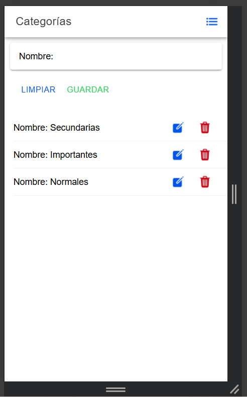
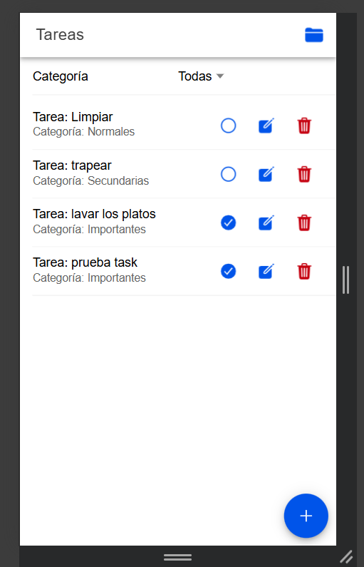
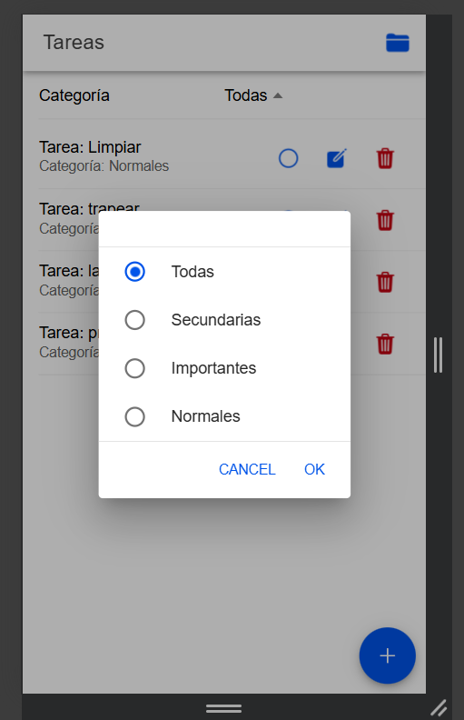
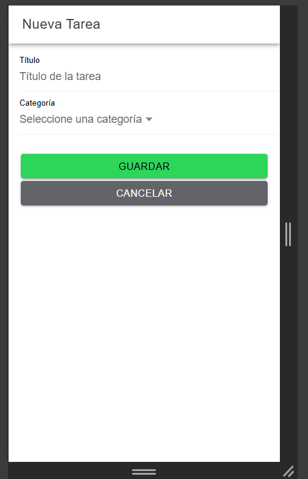
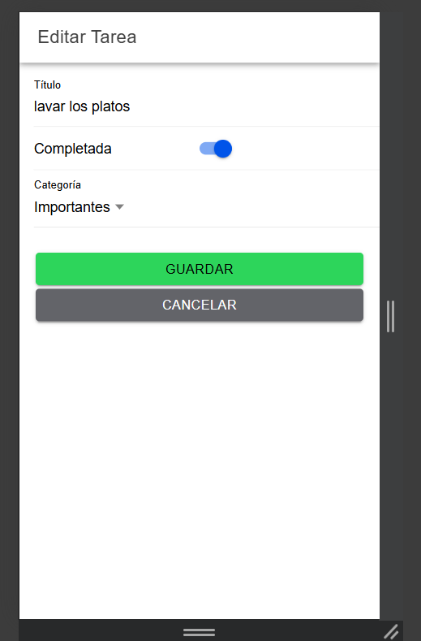

# AppTask - Aplicación de Gestión de Tareas

Una aplicación móvil desarrollada con Ionic Angular para la gestión de tareas y categorías, integrada con Firebase Firestore.

## 🚀 Cómo ejecutar la aplicación

### Prerrequisitos
- Node.js (versión 16 o superior)
- npm o yarn
- Ionic CLI: `npm install -g @ionic/cli`
- Angular CLI: `npm install -g @angular/cli`

### Instalación
1. Clonar el repositorio
2. Instalar dependencias:
   ```bash
   npm install
   ```

### Ejecución
```bash
# Desarrollo en navegador
ionic serve

# Desarrollo en dispositivo móvil
ionic capacitor run android
ionic capacitor run ios
```

## 📱 Funcionalidades

- ✅ Gestión de tareas (crear, editar, completar, eliminar)
- ✅ Gestión de categorías
- ✅ Filtrado de tareas por categoría
- ✅ Navegación entre páginas
- ✅ Integración con Firebase Firestore
- ✅ Interfaz responsive con Ionic

## 🔧 Cambios Realizados

### 1. Mejoras de Accesibilidad
- **Eventos de teclado**: Agregados `(keydown.enter)` a todos los botones para navegación por teclado
- **Cumplimiento SonarQube**: Implementadas todas las recomendaciones de accesibilidad

### 2. Navegación Mejorada
- **Botones de navegación**: Agregados en headers para navegar entre tareas y categorías
- **Router integration**: Implementada navegación programática entre páginas
- **Rutas dinámicas**: Soporte para edición de tareas con parámetros de ruta

### 3. Integración con Firebase
- **FirestoreService**: Servicio centralizado para operaciones CRUD
- **Observables**: Uso de reactive programming para actualizaciones en tiempo real
- **Gestión de errores**: Implementado manejo de errores en operaciones asíncronas

## 🏗️ Arquitectura

```
src/
├── app/
│   ├── core/
│   │   ├── models/             # Interfaces y modelos de datos
│   │   ├── services/           # Servicios de negocio
│   │   └── modules/            # Módulos compartidos
│   └── pages/
│       ├── tasks/              # Página principal de tareas
│       ├── categories/         # Gestión de categorías
│       └── task-detail/        # Detalle/edición de tareas
```

## 🛠️ Tecnologías Utilizadas

- **Ionic 8**: Framework de desarrollo móvil
- **Angular 18**: Framework web
- **Firebase Firestore**: Base de datos NoSQL
- **TypeScript**: Lenguaje de programación
- **SCSS**: Preprocesador CSS

## 📸 Capturas de Pantalla

A continuación se muestran las funcionalidades implementadas en la aplicación.

### ➤ 1. Listado de Categorías


### ➤ 2. Lista de Tareas


### ➤ 3. Filtro por Categoría


### ➤ 4. Creación de Tarea


### ➤ 5. Edición de Tarea con Categoría Preseleccionada
